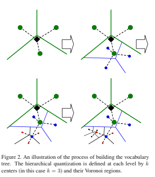
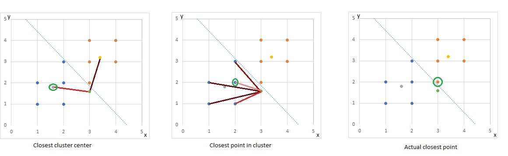

# Scalable Recognition
A pythonic implementation of [Scalable Recognition with a Vocabulary Tree (2006)](https://people.eecs.berkeley.edu/~yang/courses/cs294-6/papers/nister_stewenius_cvpr2006.pdf).

Searching for an object match in a large set of images is a difficult task for a computer. 
In [Scalable Recognition with a Vocabulary Tree (2006)](https://people.eecs.berkeley.edu/~yang/courses/cs294-6/papers/nister_stewenius_cvpr2006.pdf) 
a method is proposed how this goal could be achieved. Despite the age of this paper, few python implementations are available which is one of the motivations for this repository. 

There are a lot of variations in recognition/object detection/classification.
This repository is specifically for object detection with a large scale dataset.
The dataset consists of detailed images of the objects that need to be recognised.
In a query image either no or only one object can be detected.
It has been tested with a database size of 100_000 images which has a process time of 2s for every recognition.
Accuracy is highly dependent on how clear the object is present in the image and how large your dataset is.
To give an idea about the accuracy I found following approximate accuracies with a dataset of 100_000 images.
- The object takes up >80% of the image: accuracy = ~95+%
- The object takes up <20% of the image: accuracy = ~60%

The goal is that you can easily try out your own database object detection system without needing to program anything else. 
Parameters are used to customise your object recognition to maximise your precision.

Almost all information is based on the before mentioned [paper](https://people.eecs.berkeley.edu/~yang/courses/cs294-6/papers/nister_stewenius_cvpr2006.pdf) and a course on 'Image Analysis and Understanding' of prof. Tuytelaars at the KU Leuven who was also my mentor for this student project.
## Installation
Using conda

    conda install -c conda-forge opencv numpy-indexed

Using pip

    pip install opencv-python numpy-indexed

## How to use
### 1) Setup

Put all your database images in the `data/` folder. Every image should have the format `id.jpg` where `id` is an integer. To be complete, the ids aren't required to be sequential. The images in the `data/` folder are often refered to as the db (database) images.

Put all your query images in the `test/` folder. Every image must have a `.jpg` extension.   
**_Optional:_** _if you'd like to test the accuracy, then name every query image `id.jpg` where `id` is the id of the correct db image match._

_**Optional:** For a cleaner output, you can add a `names.p` file. This file is a pickle file containing a dictionary<integer, string>.
The number of keys must match the number of images in the `data/` folder. Each image must have one corresponding key with its id.
The corresponding value represents the name of the db image._

**Important:** Check `parameters.py` to make sure everything is set up correctly for your purposes. If you don't fully understand a parameter, most of the time the defaults are fine, but please read the 'How it works' section to understand the parameters. 
### 2) Offline

In this fase the data structure for retrieval is built.
If you did everything in the previous steps, you only need to run the `offline.py` script and everything should be setup. 
If you'd like to understand what this script exactly does, first read through this readme file and afterwards read the detailed documentation in `offline.py`.

### 3) Online

//TODO

## How it works

In this section we'll explain the principles behind the code.
It's written in a way so no prior knowledge except some programming experience is required. 
First we define the problem, then we'll explain which basic principles we use and afterwards we show how these basic principles can be used to tackle the problem.

### The problem

We have a lot of objects as db images. 
A query image (possibly) contains the same object as a db but in a different context. 
The goal is to match the query image to the correct db image where speed and accuracy define the performance of the retrieval system

_An example:_  
Our dataset exists of common landmarks. The query image is a family picture in front of a landmark that they forgot the name of. 
They input the query image, and they have a match with a reference image of the Eiffel tower (the name comes from the `names.p` file).

How will we achieve this?  
First, we'll need to be able to tell if we have the same object in two images.  
If we know that, we'll use those principles with an efficient database structure to scale it.

### The basics

In this section we'll tackle the problem of how to tell if there's an identical object in two images. 
Traditionally this is done by using local invariant features. 
First we'll define the abstract concepts afterwards two of the most popular algorithms will be explained.

1) **_Feature extraction:_** Find points of interest in an image, often referred to as keypoints (kp). 
Keypoints aren't only locations but also contain information about its size, orientation and sometimes shape.
In short keypoints define "regions" of interest in an image. 
These regions fo interest should be distinctive features of an object where a lot of information can be extracted.
Ideally these regions should always be the same points on an object no matter its scale or orientation.
Sometimes even [affine](https://stackoverflow.com/questions/42581296/homography-and-affine-transformation) transformations are accounted for by keypoint extractors.
Finally, keypoints are often pretty small. This makes it possible to recognise occluded objects by there smaller, fully visible features.
A second reason is because it's often assumed the keypoints are planar, which is approximately true only if the regions are small.
In the picture below keypoints are shown on two images in a different context. 
Note that every keypoint has a different size and has some orientation information.
The keypoint extractor used for this is SIFT, more on this later.

2) **_Feature description:_** Extract information at every keypoint in a robust and invariant way.
This information is extracted as a high dimensional feature vectors.
These feature vectors are often referred to as descriptors (des).
A feature vector of similar regions will be close in the [Euclidean n-space](http://mathonline.wikidot.com/the-distance-between-two-vectors).
To make feature descriptors robust they are often designed to be invariant for rotation transformations and lighting conditions.

3) **_Feature matching:_** Now we compare the feature vectors of two images. 
The feature vectors with the smallest Euclidean distance are matched; in other words: similar regions are matched.
This is often refined by using [Lowe's ratio test](https://stackoverflow.com/questions/51197091/how-does-the-lowes-ratio-test-work):
if there is a feature vector that is significantly closer than other feature vectors it's probably the same region in a different context.
If there is no clear match, it's probably a region that is not in both images.
So take the two closest feature vectors and only accept the closest vector as a match if the closest vector is x times closer than the second closest vector.
In the picture below, all keypoints without a clear match are represented as red dots. All accepted matches are shown in yellow.

4) **_Geometrical verification:_** Finally, we test if the matches are geometrically possible. 
We try to find a [homography](https://stackoverflow.com/questions/42581296/homography-and-affine-transformation) with the [RANSAC (Random Sampling Consensus)](https://en.wikipedia.org/wiki/Random_sample_consensus) algorithm. 
The algorithm outputs which points are in the homography (inliers) and which points aren't (outliers).
If we have enough inliers we can be pretty certain that we have recognised the same object in both images: we have some points that are clearly similar and have the same geometrical configuration.
In the picture below, the found homography is visually represented as the red box. All inliers are shown in green.

_**What algorithms are used in this project?**_  
The feature extractor and descriptor used in this project is [SIFT (Scale Invariant Feature Transform)](https://ieeexplore.ieee.org/document/790410/).
SIFT is the most widely used descriptor and [has been proven](https://ieeexplore.ieee.org/document/5955377) to be reliable.
it's possible that [MSER (Maximally Stable Extremal Regions)](https://cmp.felk.cvut.cz/~matas/papers/matas-bmvc02.pdf) could do a better job at feature extraction than [SIFT](https://ieeexplore.ieee.org/document/790410/).
Still [SIFT](https://ieeexplore.ieee.org/document/790410/) is used as the extractor here, mainly because MSER is significantly slower (at least in the opencv-python library) and initial testing showed no significant improvement that could've justified the added duration of extraction.  

//TODO toch uitleggen?

I won't explain either of the algorithms, the opencv library takes care of their implementation.
The most important thing to know for [SIFT](https://ieeexplore.ieee.org/document/790410/) is that it generates descriptors that are 128-dimensional.
If you'd like to understand the specific algorithms behind [SIFT](https://ieeexplore.ieee.org/document/790410/) and [MSER](https://en.wikipedia.org/wiki/Maximally_stable_extremal_regions) I recommend the following links:

 - [SIFT basics](https://opencv24-python-tutorials.readthedocs.io/en/latest/py_tutorials/py_feature2d/py_sift_intro/py_sift_intro.html)
 - [SIFT advanced](https://towardsdatascience.com/sift-scale-invariant-feature-transform-c7233dc60f37) (open in incognito) 
 - [SIFT youtube](https://www.youtube.com/watch?v=ram-jbLJjFg&list=PL2zRqk16wsdqXEMpHrc4Qnb5rA1Cylrhx&index=15)  (for a more complete understanding of the algorithm, watch the full playlist)
 - [MSER slides](http://www.micc.unifi.it/delbimbo/wp-content/uploads/2011/03/slide_corso/A34%20MSER.pdf)
 - [MSER youtube](https://www.youtube.com/watch?v=O0HkgXB_KY4)
 
### Scaling up

Now we know how we can recognise objects between two images, but how do we scale this up? 
[Scalable Recognition with a Vocabulary Tree (2006)](https://people.eecs.berkeley.edu/~yang/courses/cs294-6/papers/nister_stewenius_cvpr2006.pdf) shows how this can be achieved by using a clever data structure.

#### K-means

K-means is a clustering algorithm. 
K represents the amount of clusters of the end result. 
The following examples will use the 2-D space as a visualisation tool.
K-means is also usable in higher dimensions, in our case it's used in the 128 dimensional space.  
The algorithm is iterative and works as followed:

1) (initialisation) Select k random points to be te initial cluster centers
2) Match every point to its closest cluster center
3) Update every cluster center by setting it to the true cluster center of the current cluster group
4) Jump back to 2) until every point is stable

 [[1]](https://dashee87.github.io/data%20science/general/Clustering-with-Scikit-with-GIFs/)

The most used performance metric is variance aka the sum of squares, representing the compactness of the clustering.

#### K-means++
In 2007 Arthur D. and Vassilvitskii S. proposed the k-means++ algorithm which has an improved initialization step:

1) Select one random cluster center
2) For every point calculate the distance to the closest cluster center, d
3) Select a new cluster center where the probability of selecting a point is proportional to d²
4) repeat until k initial cluster centers are selected, then proceed with the normal k-means algorithm

#### Hierarchical k-means tree
The k-means++ algorithm is used to build a tree.
On all the descriptors of the db images, run the k-means algorithm, this results in k clusters.
Run k-means again in every cluster, use all descriptors of that cluster and again k clusters our found.
Keep repeating this L times, where L is short for levels.
This results in a tree with `k^L` cluster groups at the lowest level, aka leaf nodes. 
Every leaf node is the cluster center of a varying amount descriptors that are all descriptors of a specific db image.

The image below gives an example for `k = 3; L = 4`, where the k-clustering algorithm is only ran in one of the found cluster groups.
The Voronoi region is the region around a cluster center where points are closest to that cluster center and not to another cluster center of that level.

If we now want to know to which leaf node a descriptor is closest to, we don't need to calculate `k^L` distances, we just traverse the tree. 
On the first level, calculate which centroid is closest; this requires k distance calculations. 
In that cluster, do the same until you know which leaf node is closest to the descriptor.
In total this requires `L*k` distance calculations instead of `k^L`, pretty efficient!  
But what's the trade of? Accuracy.  
The image below is a visual representation of how accuracy is lost.
There are 2 clusters, the blue cluster and an orange cluster.
Both cluster centers are colored gray and yellow respectively.
The green dot is the query vector.
First the closest cluster center is selected, here the gray cluster center is closest aka the blue cluster group.
In the blue cluster group the point with coordinates `(2, 2)` is the leaf node that is selected as the closest leaf node.
The actual closest leaf node is the leaf node in the orange cluster with coordinate `(2, 3)`.
So sometimes traversing the tree results in a false closest leaf node.

I'd like to give a percentage of how often this happens, but: I've not tested that, it's dependent on which vectors are used, dependent on which K and L is chosen and more importantly it doesn't matter that much.
In a single image of dimensions 1080x1080 there are in the order of 2000 keypoints and thus also descriptors. 
Only a small percentage of that will result in the wrong leaf node, although it adds noise, the total scoring system is pretty resilient to a few wrong leaf nodes.

#### Scoring

## Further improvement

## References

[1]: Sheehan, D. (2017, May 09). Clustering with Scikit with GIFs. dashee87.github.io. https://dashee87.github.io/data%20science/general/Clustering-with-Scikit-with-GIFs/

