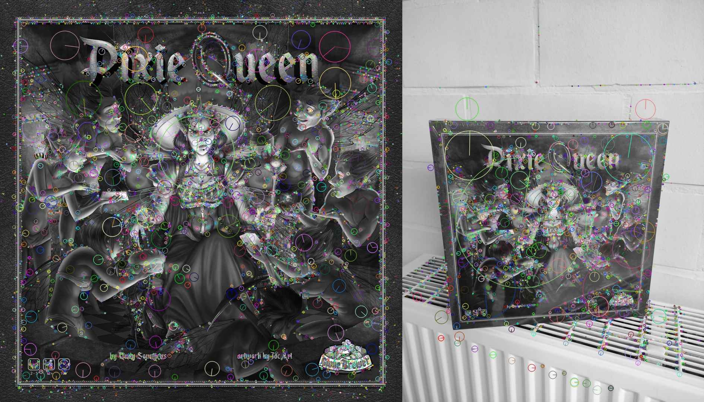
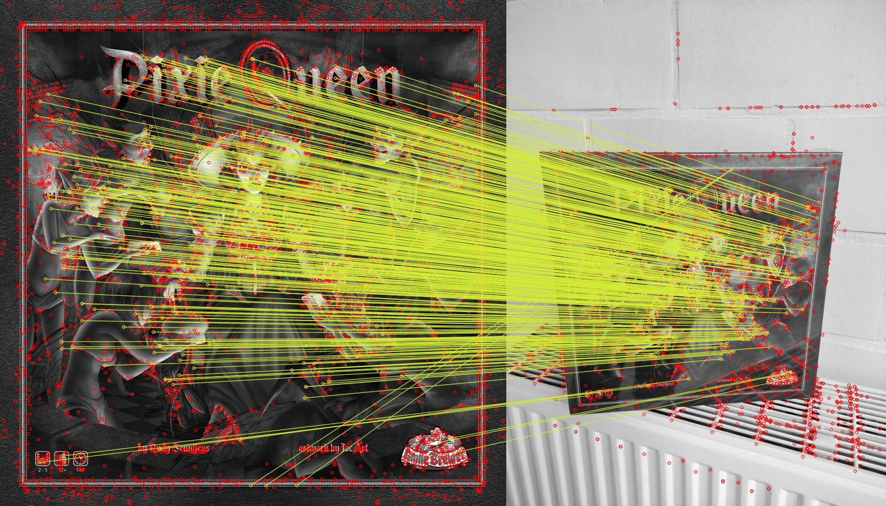
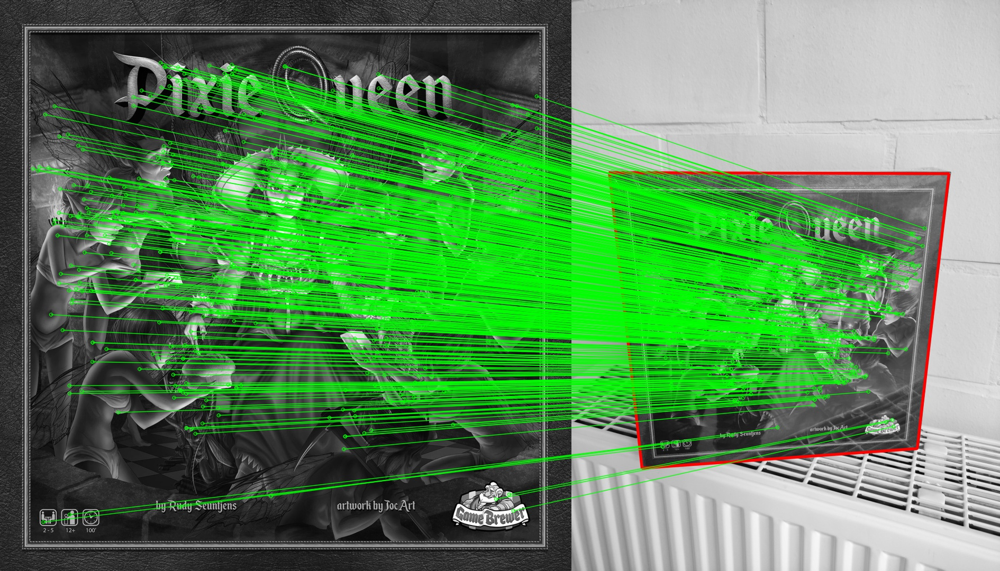

# Scalable Recognition
A pythonic implementation of [Scalable Recognition with a Vocabulary Tree (2006)](https://people.eecs.berkeley.edu/~yang/courses/cs294-6/papers/nister_stewenius_cvpr2006.pdf).

Searching for an image match in a large set of images is a difficult task for a computer. 
In [Scalable Recognition with a Vocabulary Tree (2006)](https://people.eecs.berkeley.edu/~yang/courses/cs294-6/papers/nister_stewenius_cvpr2006.pdf) 
a method is proposed how this goal could be achieved. Despite the age of this paper, few python implementations are available which is one of the motivations for this repository. 
The goal of this implementation is that you can easily try out your own database matching without needing to program anything else. 
Parameters are used to customise your database matching to maximise your precision.

Almost all information is based on the before mentioned [paper](https://people.eecs.berkeley.edu/~yang/courses/cs294-6/papers/nister_stewenius_cvpr2006.pdf) and a course text on Image Analysis and Understanding of prof. Tuytelaars at the KU Leuven who was also my mentor for this student project.
## Installation
Using conda

    conda install -c conda-forge opencv numpy-indexed

Using pip

    pip install opencv-python numpy-indexed

## How to use
### 1) Setup

Put all your database images in the `data/` folder. Every image should have the format `id.jpg` where `id` is an integer. To be complete, the ids aren't required to be sequential. The images in the `data/` folder are often refered to as the db (database) images.

Put all your query images in the `test/` folder. Every image must have a `.jpg` extension.   
**_Optional:_** _if you'd like to test the accuracy, then name every query image `id.jpg` where `id` is the id of the correct db image match._

_**Optional:** For a cleaner output, you can add a `names.p` file. This file is a pickle file containing a dictionary<integer, string>.
The number of keys must match the number of images in the `data/` folder. Each image must have one corresponding key with its id.
The corresponding value represents the name of the db image._

**Important:** Check `parameters.py` to make sure everything is set up correctly for your purposes. If you don't fully understand a parameter, most of the time the defaults are fine, but please read the 'How it works' section to understand the parameters. 
### 2) Offline

In this fase the data structure for retrieval is built.
If you did everything in the previous steps, you only need to run the `offline.py` script and everything should be setup. 
If you'd like to understand what this script exactly does, first read through this readme file and afterwards read the detailed documentation in `offline.py`.

### 3) Online

//TODO

## How it works

In this section we'll explain the principles behind the code.
It's written in a way so no prior knowledge except some programming experience is required. 
First we define the problem, then we'll explain which basic principles we use and afterwards we show how these basic principles can be used to tackle the problem.

### The problem

We have a lot of objects as db images. 
A query image (possibly) contains the same object as a db but in a different context. 
The goal is to match the query image to the correct db image where speed and accuracy define the performance of the retrieval system

_An example:_  
Our dataset exists of common landmarks. The query image is a family picture in front of a landmark that they forgot the name of. 
They input the query image, and they have a match with a reference image of the Eiffel tower (the name comes from the `names.p` file).

How will we achieve this?  
First, we'll need to be able to tell if we have the same object in two images.  
If we know that, we'll use those principles with an efficient database structure to scale it.

### The basics

In this section we'll tackle the problem of how to tell if there's an identical object in two images. 
Traditionally this is done by using local invariant features. 
First we'll define the abstract concepts afterwards two of the most popular algorithms will be explained.

1) **_Feature extraction:_** Find points of interest in an image, often referred to as keypoints (kp). 
Keypoints aren't only locations but also contain information about its size, orientation and sometimes shape.
In short keypoints define "regions" of interest in an image.
Ideally these regions of interest should be the same on an object no mather at which angle or distance it's in the image.
Therefore, keypoint detectors are often designed to be rotation, scale invariant and some affine invariant.

2) **_Feature description:_** Extract information at every keypoint in a robust and invariant way. 
This information is extracted as a high dimensional feature vectors.
These feature vectors are often referred to as descriptors (des).
A feature vector of similar regions will be close in the [Euclidean n-space](http://mathonline.wikidot.com/the-distance-between-two-vectors).
In the next section "SIFT" an example of a feature descriptor is explained.

3) **_Feature matching:_** Now we compare the feature vectors of two images. 
The feature vectors with the smallest Euclidean distance are matched; in other words: similar regions are matched.
This is often refined by using [Lowe's ratio test](https://stackoverflow.com/questions/51197091/how-does-the-lowes-ratio-test-work):
if there is a feature vector that is significantly closer than other feature vectors it's probably the same region in a different context.
If there is no clear match, it's probably a region that is not in both images.
So take the two closest feature vectors and only accept the closest vector as a match if the closest vector is x times closer than the second closest vector.

4) **_Geometrical verification:_** Finally, we test if the matches are geometrically possible. 
We try to find a homography with the [RANSAC](https://en.wikipedia.org/wiki/Random_sample_consensus) (Random Sampling Consensus) algorithm. 
The algorithm outputs which points are in the homography (inliers) and which points don't (outliers). In the picture below, the found homography is visually represented as a red box.

_**What algorithms are used in this project?**_  
The feature extractor and descriptor used in this project is [SIFT (Scale Invariant Feature Transform)](https://ieeexplore.ieee.org/document/790410/).
SIFT is the most widely used descriptor and [has been proven](https://ieeexplore.ieee.org/document/5955377) to be reliable.
it's possible that [MSER (Maximally Stable Extremal Regions)](https://cmp.felk.cvut.cz/~matas/papers/matas-bmvc02.pdf) could do a better job at feature extraction than [SIFT](https://ieeexplore.ieee.org/document/790410/).
Still [SIFT](https://ieeexplore.ieee.org/document/790410/) is used as the extractor here, mainly because MSER is significantly slower (at least in the opencv-python library) and initial testing showed no significant improvement that could've justified the added duration of extraction.  

//TODO toch uitleggen?

I won't explain either of the algorithms, the opencv library takes care of that.
The most important thing to know for [SIFT](https://ieeexplore.ieee.org/document/790410/) is that it generates descriptors that are 128-dimensional.
If you'd like to understand the specific algorithms behind [SIFT](https://ieeexplore.ieee.org/document/790410/) and [MSER](https://en.wikipedia.org/wiki/Maximally_stable_extremal_regions) I recommend the following blog posts:
 - SIFT basics: https://opencv24-python-tutorials.readthedocs.io/en/latest/py_tutorials/py_feature2d/py_sift_intro/py_sift_intro.html
 - SIFT advanced: https://towardsdatascience.com/sift-scale-invariant-feature-transform-c7233dc60f37 (open in incognito) 
 - SIFT youtube: https://www.youtube.com/watch?v=IBcsS8_gPzE&list=PL2zRqk16wsdqXEMpHrc4Qnb5rA1Cylrhx&index=16 (If you want to understand the whole algorithm, watch the full playlist)
 - MSER slides: http://www.micc.unifi.it/delbimbo/wp-content/uploads/2011/03/slide_corso/A34%20MSER.pdf
 - MSER youtube: https://www.youtube.com/watch?v=O0HkgXB_KY4
 
### Scaling up

## Further improvement

